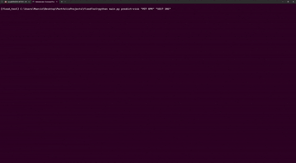

# UK Flood Risk Detection System 🌊

## Status
[](https://github.com/Zvapo/uk-flood-risk-detection/releases)
[](https://github.com/Zvapo/uk-flood-risk-detection/blob/main/LICENSE)

## Overview
This program uses a machine learning model to predict the flood risk for a given UK postcode. The model is trained on historical data and is used to predict the flood risk from an unlabelled dataset.
This is my playground project where I explore different machine learning models, prediction methods and data transformation techniques.
Feel free to use the code as you see fit.



## Flood Risk Calculation
Flood risk is calculated from the median house price in the postcode and the flood risk.

## Installation
1. Clone the repository:
``` bash
git clone https://github.com/Zvapo/uk-flood-risk-detection.git
```
2. Navigate to the project directory:
``` bash
cd uk-flood-risk-detection
```
3. Create a virtual environment:
``` bash
conda env create -f environment.yml
```
4. Activate the virtual environment:
``` bash
conda activate uk-flood-risk-detection
```

## Usage
1. Train the model, fine-tune the hyperparameters and create a postcode databse file by running:
``` bash
python main.py
```

2. The folder should now contain a file called `postcodedb.csv` which contains the postcode database as well as the models trained on the postcode labelled file.

3. Use the tool to predict the flood risk for a given UK postcode by running:
``` bash
python main.py predict-risk <postcode>
```

4. The tool will return the flood risk for the postcode given the model was trained on the postcode.

## Examples
1. Predict the flood risk for a given postcode:
``` bash
python main.py predict-risk "PO7 8PR" "SO17 1NS" # add quotes if the postcode contains a space
```

2. Add more data to the model and train it again:
``` bash
python main.py add-file file <path_to_data_file> method-risk <method_name> method-house-price <method_name>
```

3. List the available models:
``` bash
python main.py list-methods
```

4. For more information on the commands, use the help flag:
``` bash
python main.py -h
```

## Contributing
- Fork the repository and create a new branch for your feature or bugfix.
- Commit your changes and push them to your fork.
- Submit a pull request describing your changes.

## License
This project is licensed under the MIT License - see the [LICENSE](LICENSE) file for details.

## Acknowledgments
- The postcode and household information is from data provided by the [UK Office Of National Statistics](http://www.nationalarchives.gov.uk/doc/open-government-licence/version/3/) under the Open Government Licence.
- Flood risk data is derived from the [Environment Agency](https://environment.data.gov.uk/dataset/8d57464f-d465-11e4-8790-f0def148f590), adapted under the Open [Government Licence](http://www.nationalarchives.gov.uk/doc/open-government-licence/version/3/)
- Soil type data is derived from the National Soil Resources Institute maps of the [soilscapes for England and Wales](http://www.ukso.org/static-maps/soils-of-england-and-wales.html).

## Contact
For support or queries, please contact:
- Twitter: @LocusIII